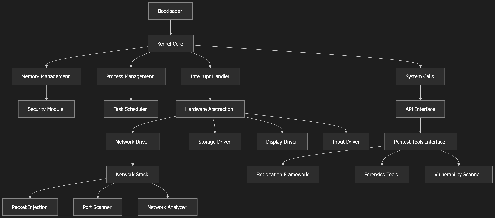

# Pentesting Kernel - Advanced OS for Security Testing

## Overview

Pentesting Kernel is a specialized operating system kernel designed specifically for penetration testing, security research, and digital forensics. Built from scratch in C for x86_64 architecture, this kernel provides a comprehensive platform for security professionals to conduct advanced security testing and analysis.

## Features

### Core Kernel Features
- **Advanced Bootloader**: GRUB2 Multiboot2-compliant with framebuffer support, ACPI support, and modular payload system
- **Memory Management**: Physical memory manager, virtual memory with 4-level page tables, kernel heap management
- **Interrupt Handling**: Complete IDT with 256 entries, exception handlers, IRQ handlers with security validation
- **System Calls**: 20+ specialized pentesting syscalls for network scanning, exploit execution, forensics analysis
- **Security Features**: Memory protection with NX bit, guard pages, comprehensive security auditing

### Device Drivers
- **VGA Driver**: Complete text mode support, color schemes, pentesting-specific display functions, memory dump capabilities
- **Keyboard Driver**: Full PS/2 keyboard support, keylogger functionality, macro recording, security features
- **Storage Driver**: IDE/ATA support, partition management, forensics capabilities, secure erase, evidence collection

### Networking Stack
- **Complete TCP/IP Stack**: Ethernet, IP, TCP, UDP, ICMP, ARP protocol support
- **Pentesting Features**: Port scanning, vulnerability scanning, packet capture, traffic analysis
- **Security Features**: Firewall, intrusion detection, packet filtering, rate limiting
- **Attack Capabilities**: ARP spoofing, DNS spoofing, various scan types (SYN, FIN, XMAS, NULL)

### Security Framework
- **Authentication System**: Token-based authentication with authorization management
- **Audit Logging**: Comprehensive audit logging and alerting system
- **Intrusion Detection**: Signature-based intrusion detection system
- **Firewall**: Rule-based filtering with advanced security modes
- **Cryptography**: Encryption, hashing, digital signatures, certificate management

### Pentesting Tools Framework
- **Session Management**: Complete pentesting session management
- **Target Discovery**: Advanced target discovery and management
- **Vulnerability Assessment**: Comprehensive vulnerability assessment and management
- **Exploit Framework**: Exploit development and execution framework
- **Scanning Capabilities**: Advanced scanning with multiple techniques
- **Reporting System**: Comprehensive reporting and analysis tools

### Forensics Framework
- **Evidence Management**: Complete forensics subsystem with evidence management
- **File Carving**: Signature-based file recovery with advanced algorithms
- **Memory Analysis**: Pattern detection and memory analysis capabilities
- **Network Analysis**: Traffic reconstruction and network forensics
- **Registry Analysis**: Windows registry analysis support
- **Log Analysis**: Pattern matching and log analysis
- **Anti-Forensics**: Detection capabilities for anti-forensics techniques

### Testing Framework
- **Comprehensive Testing**: Unit tests, integration tests, system tests
- **Performance Testing**: Built-in performance testing and profiling
- **Security Testing**: Vulnerability detection and security testing
- **Memory Testing**: Memory leak detection and corruption testing
- **Automated Testing**: Automated test execution with detailed reporting

## Architecture

### Visual Architecture Diagram

#### Architecture Overview


*Layered architecture diagram showing the complete system structure from boot layer to user applications*

For a detailed interactive representation of the CATE-Kernel architecture, please refer to:

📊 **[Interactive Architecture Diagram](docs/architecture-diagram.html)** - HTML version with interactive components and detailed specifications

### Layered Architecture Overview

The CATE-Kernel follows a sophisticated layered architecture designed specifically for penetration testing and security research:

#### 1. **User Applications Layer**
- Network Scanner Tools (Port scanning, OS detection, vulnerability scanning)
- Exploit Framework (Payload generation, shellcode development, ROP/JOP chains)
- Forensics Toolkit (File carving, memory analysis, registry analysis)
- Security Audit Tools (Authentication, privilege control, IDS/IPS)

#### 2. **System Call Interface (ABI)**
- 20+ specialized pentesting system calls
- Security-focused syscall interface
- Optimized for penetration testing workflows
- Memory-safe parameter validation

#### 3. **Kernel Core Services**
- **Process Management**: Scheduler, process/thread managers, IPC, signal handling
- **Memory Management**: Physical/virtual memory managers, kernel heap, buddy/slab allocators
- **Security Framework**: Access control, authentication, cryptography, audit logging, IDS/IPS

#### 4. **Hardware Abstraction Layer**
- **Device Drivers**: VGA/Display, Keyboard, Storage, Network, Timer drivers
- **Interrupt & Exception Handling**: IDT management, IRQ handlers, exception handlers, system call gates

#### 5. **Boot & Initialization Layer**
- **Advanced Boot Loader**: Multiboot2 parser, ACPI parser, EFI support, security features
- Hardware detection and initialization
- Memory map parsing and setup
- Security feature activation (SMEP, SMAP, NX bit)

### Technical Specifications

| Component | Specification |
|-----------|---------------|
| **Architecture** | x86_64 (64-bit) |
| **Memory Model** | 4-Level Paging with 2MB Huge Pages |
| **Security Features** | SMEP, SMAP, NX Bit, Stack Protection |
| **Boot Protocol** | GRUB2 Multiboot2 Specification Compliant |
| **File System** | Custom Pentesting-Optimized FS |
| **Network Stack** | Complete TCP/IP with Pentesting Extensions |
| **System Calls** | 20+ Specialized Pentesting Syscalls |
| **Memory Protection** | Guard Pages, Bounds Checking, ASLR |
| **Hardware Support** | ACPI, EFI, Legacy BIOS, UEFI |


## Building

### Prerequisites

- Cross-compiler toolchain (x86_64-elf-gcc, x86_64-elf-ld, etc.)
- GRUB2 for booting
- QEMU or similar emulator for testing
- Make build system

### Build Instructions

```bash
# Clone the repository
git clone https://github.com/0xHadiRamdhani/cate-kernel.git
cd pentesting-kernel

# Build the kernel
make clean
make all

# Build for debugging
make debug

# Build for release
make release

# Run static analysis
make analyze

# Install kernel
make install
```

### Build Targets

- `make all` - Build kernel binary (default)
- `make clean` - Clean build artifacts
- `make install` - Install kernel binary
- `make debug` - Build debug version
- `make release` - Build release version
- `make analyze` - Run static analysis
- `make test-build` - Test kernel build
- `make verify` - Verify kernel binary
- `make help` - Show help message

## Testing

### Running Tests

```bash
# Build test framework
cd src/testing
make all

# Run all tests (from within kernel)
make test

# Run specific test suite
make test-memory
make test-network
make test-security

# Generate test report
make report
```

### Test Categories

- **Unit Tests**: Individual component testing
- **Integration Tests**: Multi-component testing
- **System Tests**: Full system testing
- **Performance Tests**: Performance benchmarking
- **Security Tests**: Security vulnerability testing
- **Stress Tests**: System stability testing

## Usage

### Boot Process

1. **GRUB2 Boot**: Kernel boots via GRUB2 with Multiboot2 protocol
2. **Memory Detection**: Automatic memory detection and management setup
3. **Driver Initialization**: All device drivers are initialized
4. **Network Setup**: Network stack is configured
5. **Security Framework**: Security subsystem is activated
6. **Main Loop**: Kernel enters main operational loop

### Keyboard Shortcuts

- **ESC** - Debug mode
- **F1** - Show help
- **F2** - Run tests
- **F3** - Memory information
- **F4** - System information
- **F5** - Network scan
- **F6** - Forensics analysis
- **F7** - Security check
- **F8** - Performance test
- **F9** - Memory test
- **F10** - Shutdown

### Debug Mode

Enter debug mode with ESC key to access:
- Memory information
- Test execution
- System debugging
- Performance monitoring
- Custom debug commands

## Security Features

### Memory Protection
- NX bit support for code execution prevention
- Guard pages for buffer overflow detection
- Memory validation and corruption detection
- Secure memory allocation with tracking

### Access Control
- Privilege level enforcement
- System call validation
- Resource access control
- Security audit logging

### Intrusion Detection
- Real-time monitoring
- Signature-based detection
- Anomaly detection
- Automated response

## Forensics Capabilities

### Evidence Collection
- Memory dumps with integrity verification
- Network packet capture with metadata
- File system analysis with journaling
- Registry analysis for Windows systems

### Analysis Tools
- Pattern matching algorithms
- Timeline reconstruction
- Hash analysis with database lookup
- Signature verification

### Anti-Forensics Detection
- Steganography detection
- Data hiding detection
- Log tampering detection
- Evidence destruction detection

## Performance

### Optimization Features
- Efficient memory management with buddy allocator
- Optimized interrupt handling
- Fast network packet processing
- Minimal overhead security checks

### Benchmarking
- Built-in performance profiling
- Memory usage tracking
- CPU utilization monitoring
- Network throughput measurement

## Documentation

### Available Documentation
- [Development Setup Guide](development-setup-guide.md)
- [Kernel Architecture](kernel-os-pentest-architecture.md)
- [Learning Resources](learning-resources.md)
- [Project Roadmap](project-roadmap.md)

### API Documentation
- System call reference
- Driver development guide
- Security framework API
- Forensics toolkit documentation

## Contributing

### Development Guidelines
1. Follow kernel coding standards
2. Include comprehensive tests
3. Document all changes
4. Security review for all code
5. Performance impact assessment

### Code Style
- Use consistent indentation (4 spaces)
- Follow naming conventions
- Include function documentation
- Add error handling
- Memory safety checks

## License

This project is licensed under the MIT License - see the [LICENSE](LICENSE) file for details.

## Acknowledgments

- x86_64 architecture documentation
- GRUB2 Multiboot2 specification
- OSDev community resources
- Security research community
- Open source forensics tools

## Contact

For questions, bug reports, or contributions:
- Create an issue on GitHub
- Submit pull requests
- Join the development discussions

---

**Note**: This kernel is designed for educational and security research purposes. Always ensure you have proper authorization before using pentesting tools on any system.