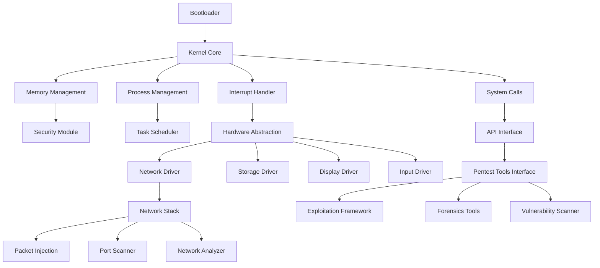

# Kernel OS Pentester Architecture & Development Plan

## Project Overview
Kernel OS pentester built from scratch using C for x86_64 architecture with multi-tool platform support.

## System Architecture

## Development Phases

### Phase 1: Foundation (8-12 weeks)
- Setup cross-compiler toolchain (x86_64-elf-gcc)
- Learn protected mode, paging, GDT/IDT
- Implement GRUB-compatible bootloader
- Basic kernel with text output

### Phase 2: Core Kernel (12-16 weeks)
- Memory management with paging
- Interrupt handling and exceptions
- System calls interface
- Process and thread management

### Phase 3: Hardware Interface (8-10 weeks)
- Keyboard and VGA driver
- ATA/ATAPI storage driver
- Network card driver (Intel e1000)
- Timer and RTC

### Phase 4: Networking Stack (10-12 weeks)
- Minimal TCP/IP stack
- Raw socket support for packet injection
- Network scanning capabilities
- Packet capture and analysis

### Phase 5: Security & Pentest Features (12-16 weeks)
- Memory protection and ASLR
- Privilege separation
- Tools interface for pentesting tools
- Forensics memory analysis

## Required Tools
- Cross-compiler: x86_64-elf-gcc
- Emulator: QEMU for testing
- Debugger: GDB with remote debugging
- Version control: Git
- Build system: Make or CMake

## Target Features
- Multi-tool platform support
- Network scanning and packet injection
- Digital forensics capabilities
- Wireless testing support
- Vulnerability assessment tools
- Secure memory management
- Hardware abstraction layer